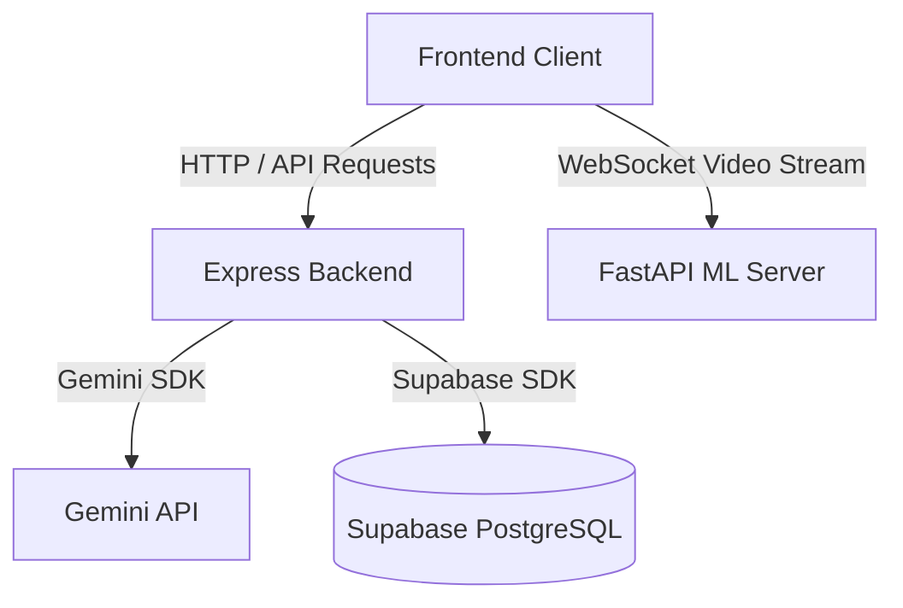

# CommuLab Frontend Client

Interactive 3D client interface for CommuLab counseling communication simulation and analysis training platform.

Backend [here](https://github.com/aipsychotutor/tutor-ai-psy-backend) | Model [here](https://github.com/aipsychotutor/tutor-ai-psy-ai-model-server)

[](https://react.dev/)
[](https://vitejs.dev/)
[](https://threejs.org/)
[](https://tailwindcss.com/)


CommuLab Frontend Client provides the user-facing workspace where counselors interact with AI-generated simulated client personas. It integrates dynamic 3D rendering (React Three Fiber) for avatar animation, microphone recording for speech-to-text input, and camera capture for real-time facial expression analysis.

## Features

- **3D Avatar Rendering:** Responsive WebGL 3D client environment with reactive avatar animations based on React Three Fiber and Three.js.
- **Speech Integration:** Live speech recognition integration to convert counselor spoken audio into text input.
- **Camera Frame Capture:** Real-time facial expression frame capture streamed to the AI Model server over WebSockets.
- **Counselor Dashboard:** Detailed interactive charts showing session performance metrics (empathy and question quality scores over time).
- **Session Reports:** Displays comprehensive analysis results, session transcripts, and supervisor narrative feedback.

## System Architecture



## Tech Stack

- **UI Framework:** React, Vite
- **3D Render Engine:** React Three Fiber (R3F), Drei, Three.js
- **Styling:** TailwindCSS
- **Data Visualization:** Recharts, Chart.js
- **Route Manager:** React Router Dom

## Getting Started

### Prerequisites

- Node.js (version 18.x or higher)
- npm (Node Package Manager)

### Installation

1. Navigate to the frontend directory:
   ```bash
   cd tutor-ai-psy-frontend
   ```
2. Install package dependencies:
   ```bash
   npm install
   ```

### Running the Client

Start the Vite local development server:
```bash
npm run dev
```
By default, the client application will be served at `http://localhost:5173` (or the port outputted in the terminal).

## Environment Variables

Configure a `.env` file in the root of the frontend folder:
```ini
VITE_WS_URL=ws://localhost:8000/ws
```

## Project Structure
```
tutor-ai-psy-frontend/
├── public/
│   ├── animations/     # Avatar animation files
│   ├── images/         # Static system assets (simulation.png)
│   └── models/         # 3D character model GLTF/GLB files
├── src/
│   ├── components/     # UI elements (Navbar, Modals, Simulation widgets)
│   ├── hooks/          # Custom react hooks (auth checks, chat managers)
│   ├── page/           # Page controllers (Auth, Dashboard, Session, Reports)
│   └── utils/          # Formatting tools and API drivers
```

## Future Improvements
- Complete unit and integration testing across frontend modules.
- Refined avatar lip-sync capabilities based on audio speech output.
- Responsive mobile layout enhancements.

## Author
Developed and maintained by the CommuLab Team.
